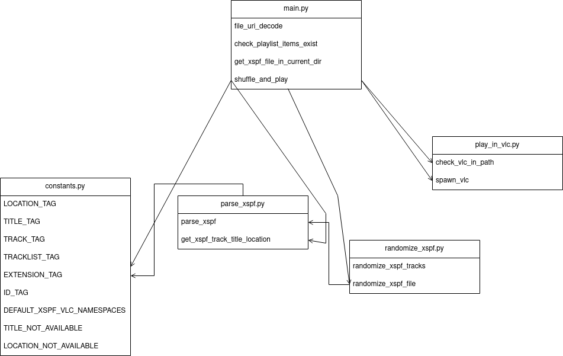

# VLCPlayShuffle

by Samuel Carballo García, 1ºDAM

Takes an XSPF file, shuffles all the items in it and plays it in VLC.

## Table of Contents

- [Setup](#setup)
- [Usage](#usage)
- [Testing](#testing)
- [Development Timeline](#development-timeline)
- [Dependency Diagram](#dependency-diagram)
- [GitFlow](#gitflow)
- [License](#license)

## Setup

1. Clone the repository.
2. Navigate to the project directory.
3. Run `pip install -U -r requirements.txt` to install the dependencies.
4. (Optional) Run `pip install -U -r requirements.test.txt` to install testing dependencies.

## Usage

You can pass the path to the XSPF file as a CLI argument, by default, if no arguments are passed, it will scan the working directory for XSPF files.

Please ensure that you have the `vlc` binary in your PATH, otherwise it will fail to run.
```bash
python main.py # will scan the current directory for XSPF files
python main.py playlist.xspf # will shuffle the playlist.xspf file
```

## Testing

1. Ensure you have installed all the dependencies in the `requirements.test.txt` file.
2. Run the following commands in the same order as below.
```bash
coverage run
coverage report
```

## Development Timeline

The free plan of Clockify only allows for reports up to 1 week, so keep in mind that the image only shows the first week of development, most of the commits after that first week are minor changes anyways.

The Clockify project has been divided in several tags:
- Documentation: mostly this README, but also includes writing the docstrings.
- Parser XSPF: this was by far the most difficult part of the whole project, I've never used XML or any XML parsing libraries before, so I had to get used to its API.
- Randomizer XSPF: randomizing the XSPF tracks was trivial thanks to the `random.shuffle` function in Python's standard library.
- Testing: I spent a good chunk of the development adding tests to get most coverage as possible, I didn't test any function in `main.py` or any other function that wraps around a function not written that me (such as exporting to a file), because those functions are already well tested by the community and are out of my scope.

## Dependency Diagram


## GitFlow
The following GitFlow has been used in this project:

- Stable branch: `master`
- Feature branches: created when a new feature is being introduced, these branches are named with the `feat/` prefix and contain the short name of the feature in kebab case.
- Other changes: bugfixes and performance improvements are pushed to the `develop` branch.

## License

This program is distributed under the GPLv3 License. For more information, see the [LICENSE](LICENSE) file.
